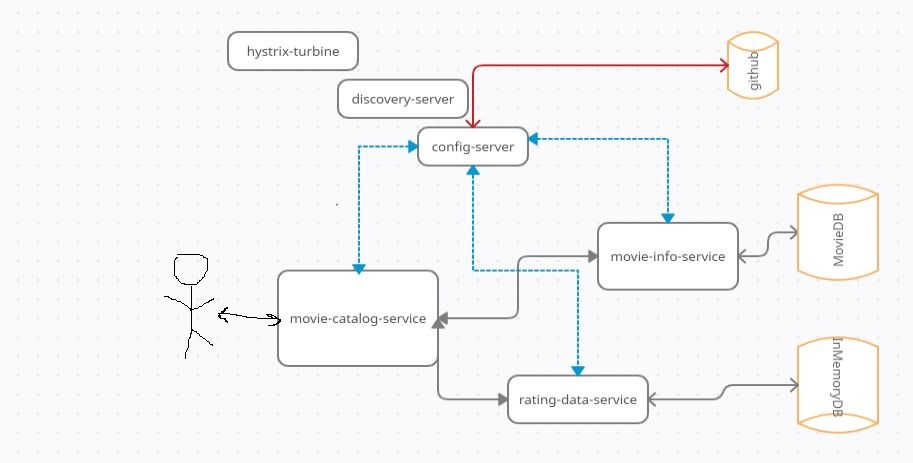
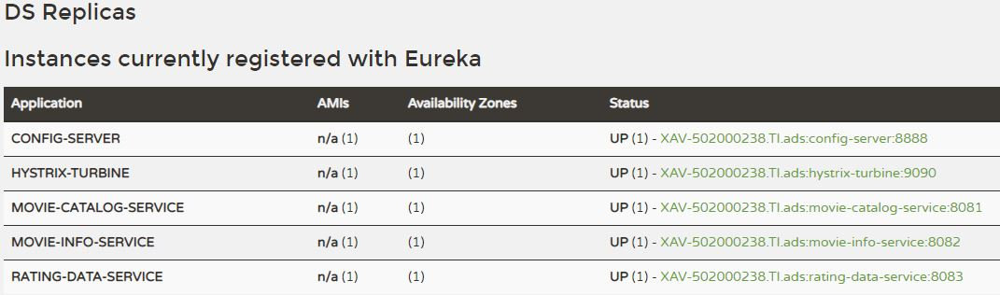
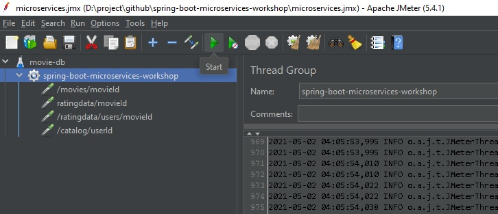
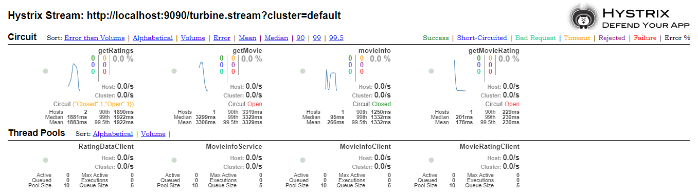
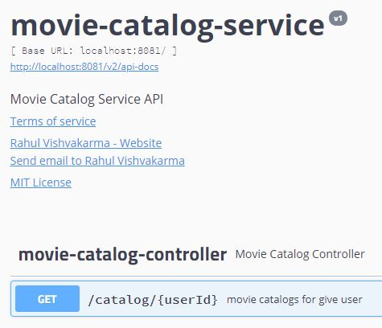
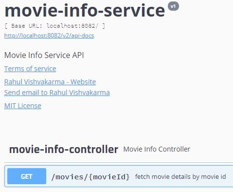
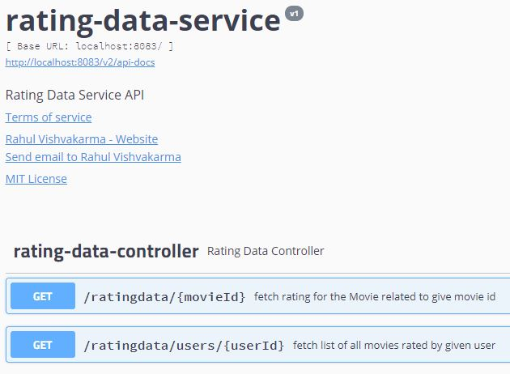

# microservices demo

This is microservices demo using few micro-services and spring cloud components.

### Technologies Used

1. Java8
2. spring-boot
3. maven

### Start MicroServices

Checkout the project using given git command
```
git clone https://github.com/vskrahul/spring-boot-microservices.git
```

Import all following projects in your favorite IDE and start in the given order
1. eureka-server
2. config-server
3. hystrix-turbine
4. movie-catalog-service
5. movie-info-service
6. rating-data-service
7. microservices-config (config)
8. microservices-starter-parent (parent pom)

To update the application port or to update other configuration.

1. Update the `application.yml` in `microservices-config`
2. Commit and push the changes into `master` branch

## Architecture



## Eureka Server



## Run jMeter



## Hystrix Turbine Dashboard



## REST Endpoints

Use swagger UI to fetch REST API documentations.

### movie-catalog-service
http://localhost:8081/swagger-ui.html



### movie-info-service
http://localhost:8082/swagger-ui.html



### rating-data-service
http://localhost:8083/swagger-ui.html


